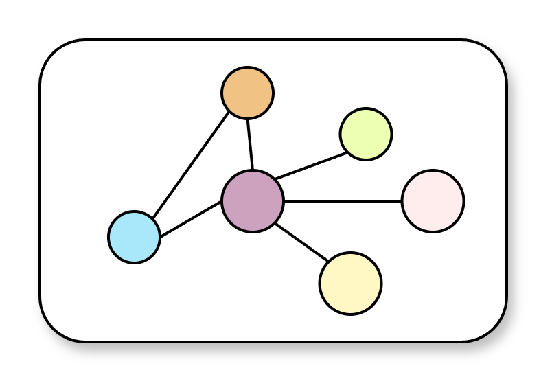

  <a href="README.md">English</a> | <b>中文</b>

<h1>OMT: Ontology for Measurement Terminology</h1>

<b>测量术语本体：面向数字计量与数字校准证书 (DCC) 的语义基座</b>

<b>The Semantic Foundation for Digital Metrology and Digital Calibration Certificate (DCC)</b>

    
    
    

## 什么是 OMT?
OMT (Ontology for Measurement Terminology) 是为测量科学构建的机器可解释的领域本体。它严格遵循 VIM (国际计量学词汇) 与 GUM (测量不确定度表示指南) 等国际标准，旨在为数字校准证书 (DCC) 等标准化格式的数字文件提供语义支撑。
## 为什么选择 OMT？
- 消除歧义：通过受控词表 (Controlled Vocabulary) 机制，为 DCC 等数字证书中的节点赋予唯一的、国际公认的计量学语义。
- 语义支撑：将扁平的校准数据转化为深层关联的知识图谱，使机器能够解释测量领域中各个概念的逻辑关系。

## 上下文关系

## 核心概念关系

 
<b>国家计量数据中心 (NMDC)</b>
 
构建数字计量时代的语义基石
 
